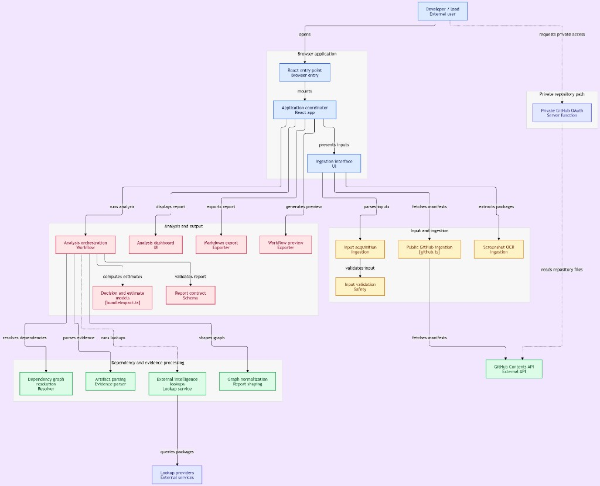

# Codebase Bloat & Technical Debt Tax

Decision-support diagnostic for JS dependency inventory, bundle-risk signals, and labeled delivery-cost estimates.

This tool estimates dependency and delivery costs. It does not prove causality, measure real-user performance without field data, or guarantee that time-value estimates convert to recovered payroll.

Live preview: https://mizcausevic-dev.github.io/codebase-bloat-tax/



Browser-only analysis. Private GitHub OAuth is a disconnected server path, not mounted on Pages. The pink model box on the chart is `models/*` (five estimate modules), not only `bundleImpact.ts`. Paste-snippet and demo upload are first-class ingest paths that the chart collapses into "input acquisition."

## Product

| Question | Answer |
| --- | --- |
| What | A local-first React app that turns manifests, lockfiles, optional bundler/CI artifacts, and import snippets into a labeled cost report. |
| Who | Staff+ web/platform engineers and tech leads deciding what to measure or remove next. |
| Why it wins | It refuses to treat package count as shipped JavaScript, shows the calculation on every card, and keeps security findings distinct from performance advice. |
| Structure | `ingestion/` → `graph/` → optional `intelligence/` → pure `models/` → Zod `schemas/` → `ui/` + `export/`. |
| Discover | Public GitHub repo, GitHub Pages preview, [pipeline visualization](docs/pipeline-viz-Cursor.html). |
| Engage | Upload, public GitHub URL, snippet/OCR, or Load demo. |
| Convert | Export PR-safe markdown or preview a warning-first GitHub Action (not auto-committed). |
| Money | Potential time value under operator assumptions. This preview is not a paid product. |
| Launch | Public GitHub repo and GitHub Pages preview. Private OAuth is a documented server path only. |
| Improve after launch | Attach measured artifacts so recommendations can move from measure-first to remove/replace. |

**Business goal:** help teams decide what to measure or remove next.  
**Page goal:** complete one analysis.  
**KPIs:** `analyses_completed` → `tool_complete`; `recommendation_exports` → `content_engagement_click`; `workflow_generated` → `self_serve_cta_click`.  
Optional GTM hooks exist only as comments. GTM is not installed.

## Filename suffix note

Estate rules mention both `-Claude` and `-Cursor` suffixes. This repo follows the Cursor system instruction (`-Cursor`). Example: `docs/pipeline-viz-Cursor.html`.

## Stack and dependency reasons

| Package | Why |
| --- | --- |
| react / react-dom | UI |
| vite / typescript / vitest | build and tests |
| zod | required report contracts; reject malformed third-party data |
| yaml | pnpm / Yarn Berry lockfiles, with `merge: false` and alias caps. Dynamic import, so npm/Yarn-classic ingest does not download it. |
| framer-motion | dashboard cards/queue only. Ingest first paint does not import it. |
| tesseract.js | in-browser OCR so screenshots are never uploaded. Dynamic import on screenshot pick. |

No lockfile parser executes package code. `npm install` is never run against an uploaded tree.

## Evidence hierarchy

1. Production bundle / source map / bundler metafile  
2. CI workflow timestamps  
3. Resolved lockfile  
4. Bundlephobia advisory (single-package min+gzip; never summed as your bundle)  
5. package.json or import screenshot  

## Formulas

```
transferTimeMs = compressedBytes / effectiveThroughputBytesPerMs + RTT overhead
annualBlockingHours = runs/week × weeks/year × blockingMinutes/run × affectedDevelopers / 60
potentialTimeValue = annualBlockingHours × hourlyCost
```

Numeric defaults live in `src/models/constants.ts` and are labeled in the UI. Gzip is never called uncompressed. Estimated build-wait is a clamped hypothesis, not observed latency.

## Data sources

- GitHub Contents API (public, unauthenticated) or local upload  
- npm registry packuments (versions, license, repository, publish time)  
- Bundlephobia `size` API (advisory only)  
- OSV (`api.osv.dev`) as an advisory-compatible vulnerability source, because `npm audit` would require executing npm against an uploaded tree  
- npm.im is a link-out only. It is not treated as size or vuln authority  

Lookups are cached in memory, timed out, and rate-limit aware. Malformed payloads are discarded.

## Permissions

- Public GitHub: no token  
- Private GitHub: Contents: read only, server-side OAuth, token not stored. Disabled on the Pages preview  
- Workflow writes: not implemented as an automatic step. The UI can preview a file; a third-party commit would require a later explicit confirmation and elevated permission  

## Security boundaries

- Uploaded manifests, lockfiles, import code, and private-repo metadata are treated as sensitive  
- Processing is in memory. History is localStorage opt-in and stores only report metadata, never raw lockfiles or tokens  
- Repository URLs must be `https://github.com/owner/repo`. IPs, `file:`, credentials, and lookalike hosts are rejected  
- File type, size, JSON depth, YAML alias caps, and `__proto__` rejection are enforced  
- This tool never runs postinstall, evals package code, or installs an uploaded project  
- Static preview CSP is a meta policy (defense in depth, not a hosting guarantee)  
- This repo makes **no production security posture claim**

## Known limitations

- Bundlephobia is not your application bundle  
- Chrome CPU throttling is not a phone  
- Opportunity cost is potential time value, not recovered payroll  
- Snippet/OCR inventories cannot resolve versions or transitive graphs  
- npm audit-style coverage does not include peer dependencies  
- GitHub Action SHAs in the **generated** YAML still need a human lookup before production use. This repo's own Pages workflow is SHA-pinned.  
- Private OAuth requires you to register a GitHub OAuth app and host the Netlify function  

## Local

```bash
npm install
npm run typecheck
npm test
npm run dev
```

Pull requests run `.github/workflows/ci.yml` (`npm ci`, typecheck, test, production build). Push to `main` still publishes via `.github/workflows/pages.yml`.

Load demo uses `public/fixtures/demo/` (parser fixture, not an installable lockfile).

## License

Apache-2.0. See [LICENSE](LICENSE).

## Security

See [SECURITY.md](SECURITY.md). Report vulnerabilities via GitHub private advisories. This preview makes **no production security-posture claim**.

## Live preview

GitHub Pages: https://mizcausevic-dev.github.io/codebase-bloat-tax/

Public upload, public GitHub URL, snippet/screenshot. Private OAuth stays disabled on Pages. Potential time value stays hidden until you opt in under Assumptions. Production source maps are not emitted.

## Screenshots

- `docs/screenshots/home-ingest-Cursor.png`

Load demo uses `public/fixtures/demo/` (`package.json` + `npm-lock.demo.json`). The demo lockfile is a parser fixture with placeholder integrity. It is not named `package-lock.json`, so Dependabot does not treat it as this app's tree. Do not run `npm install` in that folder.
